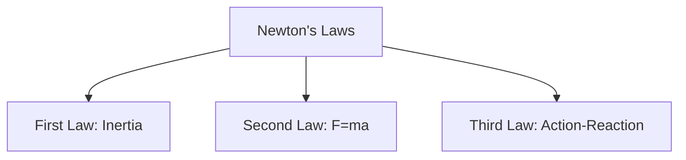

# Ask Doubt: Critical Issues & Pro Features Plan

## 🔴 CRITICAL BROKEN FEATURES

### 1. **Backend-Frontend Data Mismatch**

**Severity:** HIGH  
**Impact:** Data loss, incorrect storage

**Backend Returns:**

```json
{
  "success": true,
  "plan": "free",
  "limitInfo": { "used": 1, "limit": 2, "allowed": true },
  "data": {
    "doubtId": "xyz123",
    "metadata": {
      "subject": "Physics",
      "topic": "...",
      "difficulty": "Medium"
    },
    "answer": {
      "explanation": ["step1", "step2"],
      "intuition": "...",
      "revisionTip": "..."
    }
  }
}
```

**Frontend Expects:**

```typescript
{
  success: boolean;
  data: {
    answer: {
      explanation: string[];
      intuition: string;
      revisionTip: string;
    }
  }
}
```

**Problem:** Frontend ignores `doubtId`, `metadata`, `plan`, and `limitInfo` from backend response.

---

### 2. **Storage Layer Inconsistency**

**Severity:** HIGH  
**Impact:** Duplicate saves, data corruption

**Issue:** Two conflicting storage implementations:

- `useDoubts.ts` → calls `saveDoubtToStorage(doubtText, formattedResponse)`
- `doubts.storage.ts` → tries to save to Appwrite with fields `{ userId, doubtText, answer }`

**Backend already saves** the doubt with:

```javascript
await tablesDB.createRow({
  databaseId,
  tableId,
  rowId: ID.unique(),
  data: {
    doubtText,
    subject,
    topic,
    difficulty,
    aiAnswer: JSON.stringify(aiAnswer),
    identityType,
    identityId,
  },
});
```

**Result:** Doubt is saved TWICE (once by backend, once by frontend) with different schemas.

---

### 3. **Identity Mismatch**

**Severity:** MEDIUM  
**Impact:** User data not linked correctly

**Backend uses:**

- `identityType` (guest/user)
- `identityId` (device ID or user ID)

**Frontend storage uses:**

- `userId` from auth store
- No `identityType` or `identityId` mapping

**Problem:** Guest users' doubts saved locally won't sync when they log in.

---

### 4. **Metadata Loss**

**Severity:** MEDIUM  
**Impact:** No subject/topic/difficulty tracking

Backend infers and saves:

- `subject` (Physics, Chemistry, Biology, Math)
- `topic` (extracted keywords)
- `difficulty` (Easy, Medium, Hard)

Frontend completely ignores this metadata. No UI shows subject/topic/difficulty.

---

### 5. **Quota Display Missing**

**Severity:** LOW  
**Impact:** Poor UX, users don't know limits

Backend returns `limitInfo: { used, limit, allowed }` but frontend doesn't display:

- "2/5 doubts used today"
- Progress bar
- Warning when approaching limit

---

### 6. **Error Handling Incomplete**

**Severity:** MEDIUM  
**Impact:** Users see generic errors

Backend returns 402 with message "Daily limit reached" but frontend shows:

- Generic "Sorry, I couldn't process your doubt"
- No upgrade prompt
- No clear indication of what went wrong

---

## 📋 PRO USER FEATURES - MVP ROADMAP

### **PHASE 1: Foundation & Critical Fixes** (Week 1)

**Priority:** CRITICAL  
**Goal:** Fix broken features, establish pro/free distinction

#### 1.1 Fix Data Flow

- [ ] Update `AskDoubtResponse` type to include `doubtId`, `metadata`, `limitInfo`
- [ ] Remove duplicate storage call from `useDoubts.ts`
- [ ] Backend already saves, frontend should only read
- [ ] Update `loadDoubtsFromStorage` to fetch from backend using correct schema

#### 1.2 Quota Display

- [ ] Create `<UsageIndicator>` component showing "X/Y doubts used"
- [ ] Add to ask-doubt.tsx header
- [ ] Show warning at 80% usage
- [ ] Block input when limit reached (free users)

#### 1.3 Metadata Display

- [ ] Show inferred subject/topic/difficulty in chat bubble
- [ ] Add small badge: `🔬 Physics • Medium`
- [ ] Store metadata in Message type

#### 1.4 Error Handling

- [ ] Detect 402 status → show upgrade modal
- [ ] Show specific error messages from backend
- [ ] Add retry button for network errors

**Deliverable:** Stable, aligned askDoubt with proper quota enforcement

---

### **PHASE 2: Pro-Exclusive Features** (Week 2)

**Priority:** HIGH  
**Goal:** Give pro users unique value in askDoubt

#### 2.1 Follow-Up Questions (Pro Only)

**Feature:** Multi-turn conversations

**Free Users:**

- Each doubt is independent
- No context from previous messages

**Pro Users:**

- Can ask follow-up questions
- Backend receives conversation history
- AI maintains context across 3-5 turns

**Implementation:**

```typescript
// Backend: ai.js
export function buildGeminiPromptWithContext(doubtText, conversationHistory) {
  return `Previous conversation:
${conversationHistory.map((m) => `${m.role}: ${m.text}`).join("\n")}

New question: ${doubtText}
...`;
}
```

**UI Changes:**

- Add "Continue this doubt" button on AI responses (pro only)
- Show conversation thread visually
- Limit to 5 follow-ups per doubt

---

#### 2.2 Detailed Explanations (Pro Only)

**Feature:** Deeper, step-by-step breakdowns

**Free Users:**

- Get standard explanation (3-5 steps)
- Basic intuition
- Short revision tip

**Pro Users:**

- Get "Detailed Mode" toggle
- 8-10 steps with sub-steps
- Multiple examples
- Common mistakes section
- Practice problem suggestion

**Backend Changes:**

```javascript
// ai.js - add to schema for pro users
{
  detailedSteps: [{ step: string, reasoning: string, example?: string }],
  commonMistakes: [{ mistake: string, correction: string }],
  practiceHint: string
}
```

**UI:**

- Toggle "Detailed Explanation" (pro badge)
- Expandable sections for each step
- Highlight common mistakes in red boxes

---

#### 2.3 Visual Aids (Pro Only)

**Feature:** Diagrams, graphs, concept maps

**Implementation:**

- Backend generates Mermaid diagram syntax for:
  - Flowcharts (process explanations)
  - Mind maps (concept relationships)
  - Graphs (function plots)
- Frontend renders using `react-native-mermaid` or similar

**Example:**

````markdown
**Concept Map:**


````

````

**UI:**
- Show diagram below explanation
- Tap to expand full-screen
- Save diagram separately

---

#### 2.4 Bookmarks & Collections (Pro Only)
**Feature:** Organize doubts by topic/exam

**Free Users:**
- See all doubts in chronological order
- No organization

**Pro Users:**
- Create collections: "Thermodynamics", "Organic Chemistry", "Calculus"
- Bookmark important doubts
- Tag doubts with custom labels
- Search within collections

**Backend:**
```javascript
// New table: doubt_collections
{
  userId, collectionName, doubtIds: [], createdAt
}
````

**UI:**

- "Add to Collection" button on each doubt
- Collections tab in ask-doubt screen
- Drag-and-drop to organize

---

#### 2.5 Export & Share (Pro Only)

**Feature:** Download doubts as PDF/Markdown

**Free Users:**

- Can only view in app

**Pro Users:**

- Export single doubt as PDF
- Export collection as study guide
- Share doubt link with friends (read-only)

**Implementation:**

- Use `react-native-html-to-pdf` for PDF generation
- Generate shareable links with expiry (24h)

---

### **PHASE 3: Advanced AI Features** (Week 3-4)

**Priority:** MEDIUM  
**Goal:** Leverage AI for deeper learning

#### 3.1 Doubt Difficulty Adjustment (Pro Only)

**Feature:** AI adapts explanation complexity

**How it works:**

- Pro users can rate explanation: "Too simple" / "Too complex"
- Backend adjusts prompt for next doubt
- Stores user's preferred difficulty level

**Backend:**

```javascript
// New field in users table: preferredExplanationLevel (1-5)
// Adjust prompt based on level
if (userLevel >= 4) {
  prompt += "\nUse advanced terminology, assume strong foundation.";
} else if (userLevel <= 2) {
  prompt += "\nUse simple language, explain basics first.";
}
```

---

#### 3.2 Related Concepts Suggestion (Pro Only)

**Feature:** AI suggests related topics to study

**After answering a doubt:**

```json
{
  "relatedConcepts": [
    { "topic": "Kirchhoff's Laws", "reason": "Builds on Ohm's Law" },
    { "topic": "RC Circuits", "reason": "Practical application" }
  ]
}
```

**UI:**

- Show "Related Topics" section
- Tap to generate notes or questions on that topic
- Build a knowledge graph over time

---

#### 3.3 Exam-Style Rephrasing (Pro Only)

**Feature:** Show how doubt could appear in NEET/JEE

**After explanation:**

```json
{
  "examVariations": [
    "In NEET 2022, this was asked as: ...",
    "JEE Advanced twist: What if we add a constraint..."
  ]
}
```

**UI:**

- "How this appears in exams" section
- Practice button → generates similar question

---

#### 3.4 Voice Input (Pro Only)

**Feature:** Ask doubts by speaking

**Implementation:**

- Use `expo-speech-recognition`
- Convert speech to text
- Send to backend as normal doubt

**UI:**

- Mic button in input field
- Real-time transcription
- Edit before sending

---

#### 3.5 Doubt Analytics (Pro Only)

**Feature:** Track learning patterns

**Metrics:**

- Most asked subjects
- Difficulty distribution
- Topics needing revision
- Improvement over time

**UI:**

- New "Insights" tab
- Charts showing progress
- Weak areas highlighted
- Suggested study plan

---

### **PHASE 4: Collaboration & Gamification** (Week 5-6)

**Priority:** LOW (Post-MVP)  
**Goal:** Increase engagement

#### 4.1 Doubt Leaderboard (Pro Only)

- See how many doubts you've resolved
- Compare with friends (opt-in)
- Badges: "Curious Learner", "Physics Master"

#### 4.2 Community Doubts (Pro Only)

- Browse anonymized doubts from other users
- Upvote helpful explanations
- Request AI to re-explain in different way

#### 4.3 Tutor Mode (Pro Only)

- Pro users can answer other users' doubts
- Earn points/badges
- AI validates answer quality

---

## 🎯 IMPLEMENTATION PRIORITY

### Must-Have (MVP)

1. ✅ Fix data flow (Phase 1.1)
2. ✅ Quota display (Phase 1.2)
3. ✅ Follow-up questions (Phase 2.1)
4. ✅ Detailed explanations (Phase 2.2)
5. ✅ Bookmarks (Phase 2.4)

### Should-Have (MVP+)

6. Visual aids (Phase 2.3)
7. Export/Share (Phase 2.5)
8. Difficulty adjustment (Phase 3.1)
9. Related concepts (Phase 3.2)

### Nice-to-Have (Post-MVP)

10. Exam rephrasing (Phase 3.3)
11. Voice input (Phase 3.4)
12. Analytics (Phase 3.5)
13. Gamification (Phase 4)

---

## 📊 FEATURE COMPARISON TABLE

| Feature                 | Free | Pro              |
| ----------------------- | ---- | ---------------- |
| Daily Doubts            | 2    | Unlimited        |
| Follow-up Questions     | ❌   | ✅ (5 per doubt) |
| Detailed Explanations   | ❌   | ✅               |
| Visual Diagrams         | ❌   | ✅               |
| Bookmarks & Collections | ❌   | ✅               |
| Export as PDF           | ❌   | ✅               |
| Difficulty Adjustment   | ❌   | ✅               |
| Related Concepts        | ❌   | ✅               |
| Exam-Style Rephrasing   | ❌   | ✅               |
| Voice Input             | ❌   | ✅               |
| Analytics Dashboard     | ❌   | ✅               |
| Priority Support        | ❌   | ✅               |

---

## 🛠️ TECHNICAL CHANGES REQUIRED

### Backend (askDoubt/index.js)

```javascript
// Add pro-specific logic
const isPro = plan === "pro";

if (isPro && body.conversationHistory) {
  prompt = buildGeminiPromptWithContext(doubtText, body.conversationHistory);
}

if (isPro && body.detailedMode) {
  aiAnswer = await callGeminiAPI(prompt, detailedDoubtsSchema, log);
}

// Return pro-specific fields
return res.json(buildResponse(true, plan, quota, {
  doubtId: doubt.$id,
  metadata: meta,
  answer: aiAnswer,
  proFeatures: isPro ? {
    relatedConcepts: [...],
    examVariations: [...],
    visualAid: mermaidSyntax
  } : null
}));
```

### Frontend (useDoubts.ts)

```typescript
// Add pro feature flags
const { user, isPro } = useAuthStore();

// Show pro features conditionally
if (response.data.proFeatures && isPro) {
  setRelatedConcepts(response.data.proFeatures.relatedConcepts);
  setVisualAid(response.data.proFeatures.visualAid);
}
```

### New Components Needed

1. `<FollowUpButton>` - Continue conversation
2. `<DetailedToggle>` - Switch explanation depth
3. `<VisualDiagram>` - Render Mermaid diagrams
4. `<BookmarkButton>` - Save to collection
5. `<ExportButton>` - Download as PDF
6. `<RelatedTopics>` - Show suggestions
7. `<DoubtAnalytics>` - Charts and insights

---

## 🚀 ROLLOUT STRATEGY

### Week 1: Fix Critical Issues

- Deploy Phase 1 fixes
- Test with 10 beta users
- Monitor error rates

### Week 2: Launch Core Pro Features

- Deploy Phase 2.1, 2.2, 2.4
- Announce to existing pro users
- Collect feedback

### Week 3-4: Add Advanced Features

- Deploy Phase 3.1, 3.2
- A/B test feature adoption
- Iterate based on usage

### Week 5-6: Polish & Optimize

- Performance improvements
- UI/UX refinements
- Prepare for public launch

---

## 📈 SUCCESS METRICS

### Engagement

- Pro users ask 3x more doubts than free users
- 60% of pro users use follow-up questions
- 40% create at least one collection

### Retention

- Pro users return 5+ days/week
- 80% of pro users renew subscription
- NPS score > 50

### Quality

- 90% of explanations rated "helpful"
- <5% error rate in AI responses
- <2s average response time

---

## 🔒 SECURITY & PRIVACY

### Data Protection

- Encrypt all doubt text in database
- Anonymize doubts for community features
- Allow users to delete all data

### Rate Limiting

- Pro users: 1000 doubts/day (prevent abuse)
- Free users: 2 doubts/day
- Exponential backoff for rapid requests

### Content Moderation

- Flag inappropriate doubts
- Block spam/abuse
- Human review for flagged content

---

## 💡 FUTURE CONSIDERATIONS

### AI Model Improvements

- Fine-tune Gemini on NEET/JEE past papers
- Add subject-specific models
- Improve Hinglish understanding

### Platform Expansion

- Web version of ask-doubt
- WhatsApp bot integration
- Offline mode with cached responses

### Monetization

- Tiered pro plans (Pro, Pro+, Ultimate)
- Pay-per-doubt for free users
- B2B coaching institute licenses

---

**Document Version:** 1.0  
**Last Updated:** 2024  
**Owner:** Engineering Team
